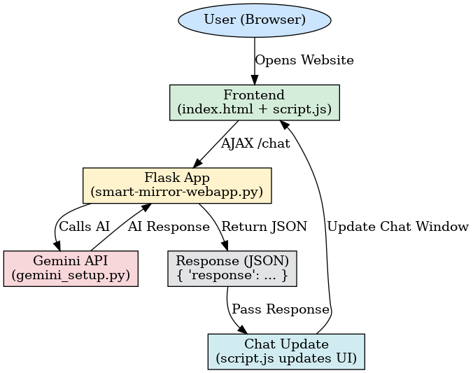

# 🤖 Smart AI Chatbot using Flask & Google Gemini

Welcome to the **Smart AI Chatbot** project – a free and open-source chatbot powered by **Python Flask** and **Google Gemini API**. This project allows you to build your own intelligent chatbot capable of understanding and responding in natural language.

---

## 🚀 Features

- 🧠 AI-powered conversations using Google Gemini
- 🌐 Flask web app with real-time chat interface
- 🎨 Beautiful and responsive UI (HTML/CSS/JS)
- 🔒 Secure and lightweight backend
- 💬 Easy integration and customization
- 💯 Completely FREE to use (uses Gemini free-tier API)

---

## 📦 Tech Stack

- **Frontend**: HTML, CSS, JavaScript
- **Backend**: Python (Flask)
- **AI Engine**: Google Gemini API
- **Tools**: VS Code, logging (for testing)

---
## 🖼️ Demo Screenshot
 
---
## Screenshot


## 📁 Project Structure

```
Smart AI chat bot/
│
├── smart-mirror-webapp.py # Flask backend
├── gemini_setup.py # Gemini API setup
├── .env # API key stored securely
│
├── templates/
│ └── index.html # Frontend page
│
├── static/
│ ├── style.css # Styling
│ └── script.js # Chatbot logic
│
├── requirements.txt # Dependencies
├── README.md # Documentation
└── flowchart.png # Architecture diagram
```

---

## 🔧 Installation & Setup

1. **Clone the repository:**
   ```bash
   git clone https://github.com/Skeerthipriya-AIML/SmartAI-chatbot
   cd smart-ai-chatbot
   ```

2. **Create a virtual environment (optional but recommended):**
   ```bash
   python -m venv venv
   source venv/bin/activate  # On Windows: venv\Scripts\activate
   ```

3. **Install the dependencies:**
   ```bash
   pip install -r requirements.txt
   ```

4. **Add your Google Gemini API key:**
   - Create a `.env` file and write as: G00GLE_API_KEY="Your_API_key_here" (Secure way to store your private keys)

5. **Run the app:**
   ```
    python smart-mirror-webapp.py
   ```

6. **Open your browser:**
   ```
   http://127.0.0.1:5000
   ```

---


## 💡 Customization Tips

- Modify `templates/index.html` for UI changes
- Update response logic in `app.py`
- Add logging, chat history, user auth for advanced features

---


## License
This project is licensed under the MIT License - see the [LICENSE](LICENSE) file for details.

---

## 🙋‍♂️ Author & Support

Created by **KEERTHI PRIYA**  
📧 Email: kirtipriya032005@gmail.com  
🔗 GitHub: https://github.com/Skeerthipriya-AIML


---


